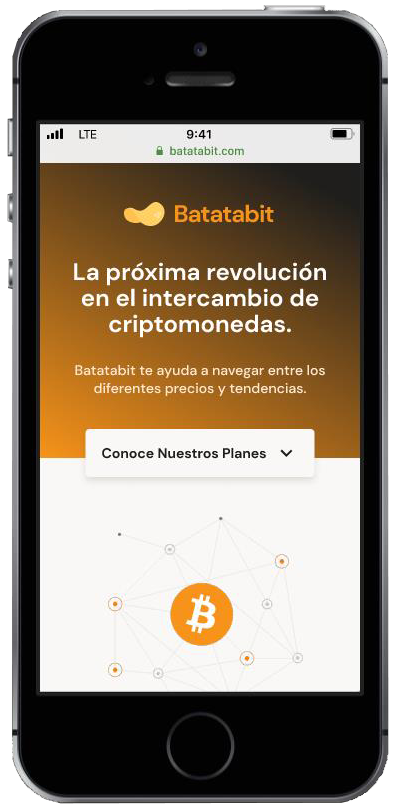

# Layout-Mobile
 

  

### Gif
Para crear el git de arriba I leave the link [here](https://www.getcloudapp.com/ "here"), solo necesitas un correo para poder usarlo y si prefieres download the desktop application I leave the link [here](https://www.getcloudapp.com/download/windows "here").

### figma
La realización esta página web estática, It was obtained from a design template made in figma, que por cierto aqui dejo el enlace para ir [figma](https://www.figma.com/ "figma")  compartido por el [Curso Definitivo de HTML y CSS](https://platzi.com/clases/html-css/ "Curso Definitivo de HTML y CSS") de [platzi](http://https://platzi.com/ "platzi"), where you can find diversity of courses in which this [Escuela de Programación y Desarrollo de Software](https://platzi.com/software/ "Escuela de Programación y Desarrollo de Software"). 

  

### Static web page
La visualización de esta página web, you can clik [here](https://brunomaldonado.github.io/Layout-Mobile/ "here").🤖 

------------

> Creator: Bruno Maldonado Rigoberto.
